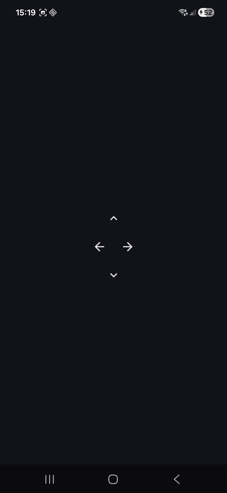

# ServoControl

Control a physical servo motor from multiple controllers:

-   **Raspberry Pi Pico (C)** firmware driving the servo
-   **Android app** that sends commands over the network (MQTT)

The goal of this project is to explore embedded control + mobile UI +
messaging (MQTT) in one small, hackable setup.

------------------------------------------------------------------------

## Features

-   🎛 **Raspberry Pi Pico servo driver**
    -   Uses the Pico SDK and PWM to drive a standard hobby servo\
    -   Designed to receive target angles from a queue / MQTT messages\
    -   Supports a simple mapping from logical angle (0--180°) to PWM
        duty cycle
-   📱 **Android controller app**
    -   UI to send control commands to the servo\
    -   Can be extended with sliders / buttons / presets (e.g. "Left",
        "Center", "Right")\
    -   Good playground for integrating MQTT or HTTP with Android
-   ☁ **Network control (MQTT-ready)**
    -   Firmware prepared to integrate with an MQTT client module\
    -   Idea: publish angles from Android → MQTT broker → Pico
        subscribes and moves the servo

------------------------------------------------------------------------

## Project structure

ServoControl/ ├── ServoCode/ \# C firmware for Raspberry Pi Pico │ ├──
CMakeLists.txt \# Pico SDK build configuration │ ├── mqtt/ \#
MQTT-related headers/sources (WIP) │ └── ... \# main servo logic, PWM,
queue, etc. └── Android/ └── ControlServo/ \# Android app project for
remote control ├── app/ ├── build.gradle └── ...

------------------------------------------------------------------------

## Hardware & Software Requirements

### Hardware

-   Raspberry Pi Pico or Pico W
-   Standard hobby servo (SG90 / MG90S)
-   External 5V power recommended
-   Optional joystick module

### Software

-   Pico SDK, CMake, arm-none-eabi toolchain
-   Android Studio
-   MQTT broker if using network control

------------------------------------------------------------------------

## Getting Started

### Clone the project

    git clone https://github.com/milutin2002/ServoControl.git
    cd ServoControl

### Build the Pico firmware

    cd ServoCode
    mkdir build && cd build
    cmake .. -DWIFI_SSID=<wifi_name> -DWIFI_PASS=<wifi_password>
    make

Flash the generated `.uf2` to your Pico.

### Wiring

-   Servo VCC → 5V\
-   Servo GND → Pico GND\
-   Servo Signal → PWM-capable GPIO (e.g., GP15)

### Android App

Open `Android/ControlServo` in Android Studio.

### Pictures

------------------------------------------------------------------------

## License

No license yet --- consider MIT/Apache-2.0.

------------------------------------------------------------------------

## Author

**Milutin Jovanović**
